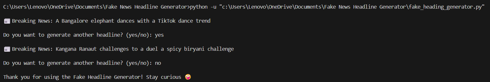

# 📰 Fake News Headline Generator

A fun and interactive Python project that randomly generates fake and humorous news headlines using Indian-themed names, actions, and places. This project is designed to demonstrate the practical use of Python basics like lists, loops, user input, and string formatting.

---
## 📸 Screenshot

---

## 📌 Features

- Generates a new, funny fake news headline each time
- Uses Indian context (Bollywood, Cricket, Politics, etc.) for relatability
- Text-based interface with interactive user input
- Simple logic using only core Python—no external libraries required

---

## 🎯 Why I Built This

I built this project as a way to **practice and reinforce core Python concepts** in a fun and creative way. It helped me improve my understanding of:
- List operations
- Random selection
- Loops and conditional logic
- User input handling
- String formatting with f-strings

---

## 🧠 Concepts Used

- `random.choice()` – for randomly selecting items from a list
- Python `lists` – for organizing subjects, actions, and places
- `while` loop – to repeatedly generate headlines until the user stops
- `input()` – to get user interaction
- `f-strings` – for clean and readable string formatting

---

## ⚙️ How It Works

1. Import the `random` module.
2. Create 3 lists: `subject`, `actions`, and `places_or_things`.
3. Use `random.choice()` to select one word from each list.
4. Combine the selected words into a complete headline using f-strings.
5. Print the headline and ask the user if they want another one.
6. Repeat the process until the user types `no`.

---

## 📂 Files Included

- `fake_news_generator.py` – main Python script

---

## 📚 License

This project is open-source and free to use.

---

## 🙋‍♂️ Author

**Rohan Nayak**

Connect with me on [LinkedIn](https://www.linkedin.com/)  
